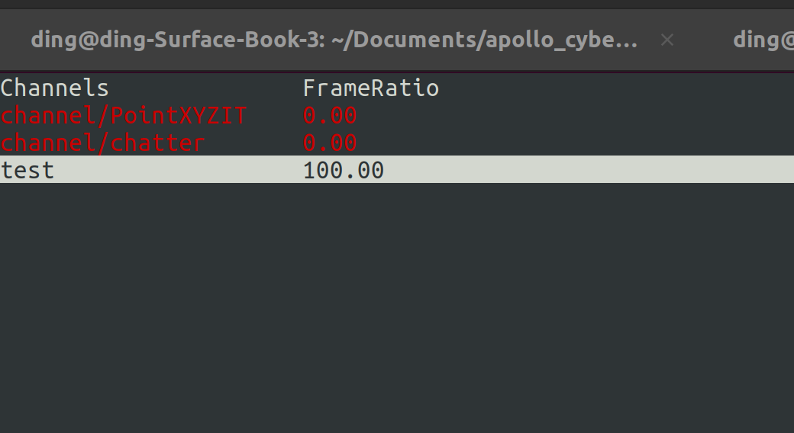
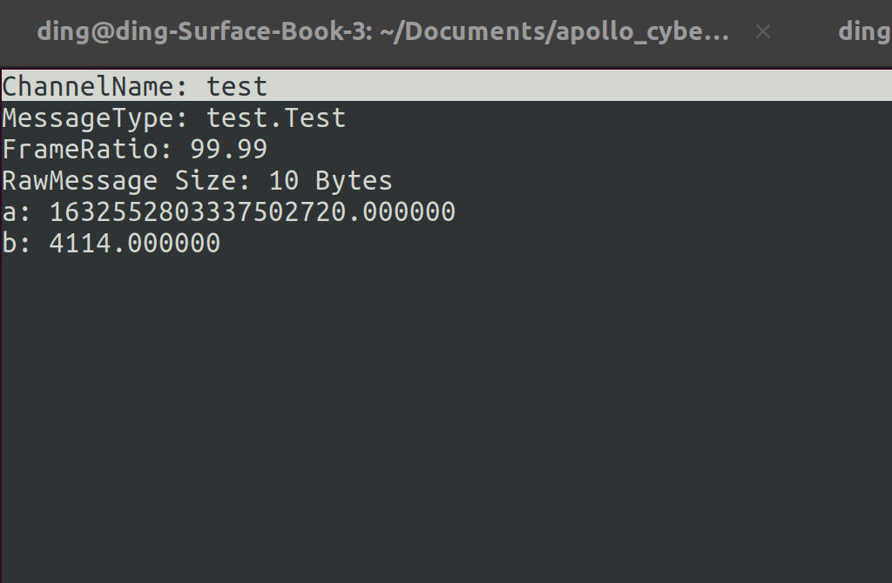
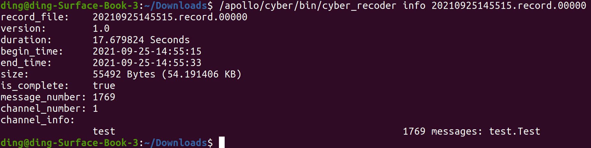

# Description
This project is a demo which show you how to use [apollo cyber](https://github.com/FengD/apollo_cyber).

# Steps
1. Create your own [proto](test.proto) file. You could also use the pre-defined [proto](https://github.com/FengD/apollo_cyber/tree/master/sensor_proto) in [cyber project](https://github.com/FengD/apollo_cyber);
2. Read the user guide of apollo cyber. Create the [test code](talker.cc)
``` c++
#include "cyber/cyber.h"
#include "test.pb.h"

using apollo::cyber::Rate;
using apollo::cyber::Time;

int main(int argc, char *argv[]) {
  // init cyber framework
  apollo::cyber::Init(argv[0]);
  // create talker node
  auto talker_node = apollo::cyber::CreateNode("test");
  // create talker
  auto talker = talker_node->CreateWriter<test::Test>("test");
  Rate rate(100.0);
  uint64_t seq = 0;
  while (apollo::cyber::OK()) {
    auto msg = std::make_shared<test::Test>();
    msg->set_a(Time::Now().ToNanosecond());
    msg->set_b(seq);
    talker->Write(msg);
    AINFO << "talker sent a message! No. " << seq;
    seq++;
    rate.Sleep();
  }
  return 0;
}

```
3. [develop tools](https://github.com/ApolloAuto/apollo/blob/master/docs/cyber/CyberRT_Developer_Tools.md)

* cyber_monitor


* cyber_recorder

